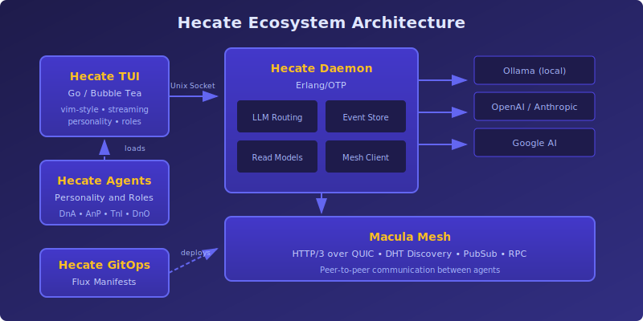
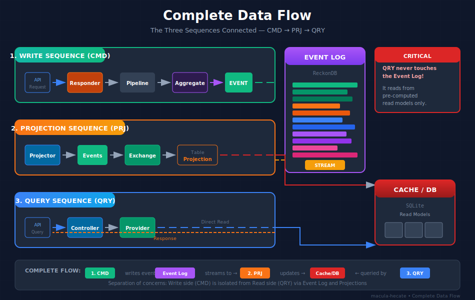

# Hecate

<div align="center">
  

  <h3>Developer Studio for Macula Mesh Applications</h3>

  <p><em>Build distributed, event-sourced applications with AI assistance — entirely from your terminal.</em></p>

  [](LICENSE)
  [](https://buymeacoffee.com/rlefever)
</div>

---

## What is Hecate?

Hecate is **not just another AI chatbot**.

It's a complete development environment for building applications on the [Macula mesh network](https://github.com/macula-io/macula-ecosystem). The TUI provides an AI-assisted workspace where you:

- **Discover & Analyze** codebases with intelligent exploration
- **Architect & Plan** distributed systems with event sourcing patterns
- **Implement & Test** with AI pair programming
- **Deploy & Operate** via GitOps to edge infrastructure

All while connected to a decentralized mesh where your applications can discover peers, share capabilities, and communicate through distributed events.

<p align="center">
  
</p>

---

## The Ecosystem

| Component | Description | |
|-----------|-------------|---|
| **hecate-tui** | Terminal developer studio (Go/Bubble Tea) | [GitHub](https://github.com/hecate-social/hecate-tui) |
| **hecate-daemon** | Local runtime with LLM routing & mesh connectivity (Erlang/OTP) | [Docker](https://ghcr.io/hecate-social/hecate-daemon) |
| **hecate-agents** | Personality system & development philosophy | |
| **hecate-gitops** | Flux manifests for Kubernetes deployment | |

---

## The Agentic Lifecycle (ALC)

Hecate structures development into four phases. The AI assistant adapts its behavior to each phase.

<p align="center">
  
</p>

| Phase | Name | Focus |
|-------|------|-------|
| **DnA** | Discovery & Analysis | Understand the problem before solving it |
| **AnP** | Architecture & Planning | Design with event sourcing, vertical slices |
| **TnI** | Testing & Implementation | Build incrementally, verify continuously |
| **DnO** | Deployment & Operations | Ship via GitOps, monitor, iterate |

**The wheel turns. Each phase feeds the next.**

→ See [Overview](guides/overview.md) for the complete ALC workflow.

---

## Cartwheel Architecture

Applications built with Hecate follow the **Cartwheel** pattern:

<p align="center">
  
</p>

| Sequence | Purpose |
|----------|---------|
| **CMD** | Commands enter, events are produced |
| **PRJ** | Events become read models |
| **QRY** | Queries are served from read models |

**Spokes = Vertical Slices.** Each business capability is self-contained.

→ See [Architecture](guides/architecture.md) for implementation details.

---

## Documentation

### Getting Started

- [**Overview**](guides/overview.md) — What Hecate is and why it exists
- [**Getting Started**](guides/getting-started.md) — Install and run your first session
- [**Architecture**](guides/architecture.md) — How the components fit together

### Using the Studio

- [**TUI Usage**](guides/tui-usage.md) — Commands, shortcuts, and workflows
- [**Personality System**](guides/personality-system.md) — Configure AI behavior and roles
- [**Daemon API**](guides/daemon-api.md) — REST API reference

### Building Mesh Applications

- [**Mesh Integration**](guides/mesh-integration.md) — Connect to Macula, discover peers, share capabilities
- [**Deployment**](guides/deployment.md) — GitOps deployment to Kubernetes

---

## Why Hecate?

### For Mesh Application Developers

The Macula mesh enables decentralized, peer-to-peer applications. Hecate gives you an AI-powered development environment that understands distributed systems, event sourcing, and mesh architecture patterns.

### Local-First, Privacy-Respecting

Your code, your conversations, your data — all local. Use Ollama for completely offline development, or connect to commercial providers when you choose.

### Terminal-Native

No browser tabs. No Electron. Just your terminal, SSH-accessible from anywhere, with vim-style efficiency for developers who live in the command line.

### Opinionated Architecture

Hecate embodies strong opinions about how distributed applications should be built:
- **Event Sourcing** — Capture intent, not just state
- **Vertical Slicing** — Features own their infrastructure
- **Screaming Architecture** — Names reveal purpose

The AI assistant is trained on these patterns and guides you toward them.

---

## Quick Start

```bash
# Install daemon
docker run -d --network host \
  -v /run/hecate:/run/hecate \
  ghcr.io/hecate-social/hecate-daemon:latest

# Install TUI
curl -fsSL https://github.com/hecate-social/hecate-tui/releases/latest/download/hecate-tui-linux-amd64.tar.gz | tar xz
sudo mv hecate-tui /usr/local/bin/

# Launch
hecate-tui
```

See [Getting Started](guides/getting-started.md) for detailed instructions.

---

## Community

- **GitHub**: [hecate-social](https://github.com/hecate-social)
- **Macula Ecosystem**: [macula-io](https://github.com/macula-io/macula-ecosystem)

## License

Apache 2.0 — See [LICENSE](LICENSE)

---

<p align="center">
  <sub>Named after the Greek goddess of crossroads and guidance.<br/>Built with Erlang/OTP and Go.</sub>
</p>
