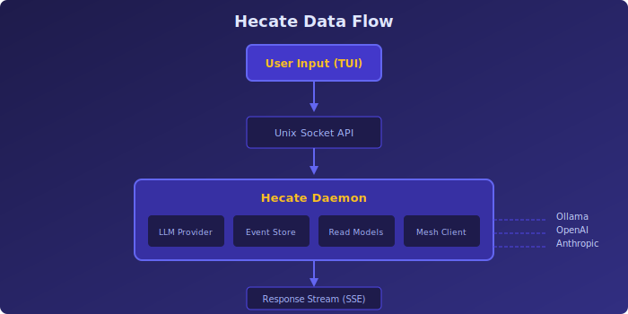

# Hecate Ecosystem

[](LICENSE)
[](https://buymeacoffee.com/rlefever)

<p align="center">
  
</p>

<p align="center">
  <strong>Documentation hub for the Hecate AI Agent Platform</strong>
</p>

---

## What is Hecate?

Hecate is a **local-first AI agent platform** that connects your terminal to intelligent assistants running on your own hardware. The ecosystem combines:

- **Local LLM Routing** - Run models via Ollama or connect to commercial providers
- **Mesh Networking** - Peer-to-peer communication between agents via Macula mesh
- **Personality System** - Configurable agent personas with role-based behaviors
- **Event Sourcing** - Full audit trail of agent interactions and decisions

Named after the Greek goddess of crossroads and guidance, Hecate helps you navigate the intersection of human intent and AI capability.

## Architecture Overview

<p align="center">
  
</p>

## The Ecosystem

The platform comprises four core components:

---

### Hecate Daemon — Local Agent Runtime

An Erlang/OTP daemon that runs on your machine, providing LLM routing, mesh connectivity, and event-sourced state management.

| Component | Description | Links |
|-----------|-------------|-------|
| **hecate-daemon** | Erlang daemon with REST API over Unix socket | [GitHub](https://github.com/hecate-social/hecate-daemon) \| [Docker](https://ghcr.io/hecate-social/hecate-daemon) |

**Core capabilities:**
- **Multi-Provider LLM** - Ollama, OpenAI, Anthropic, Google (auto-detected from env vars)
- **Streaming Chat** - Server-sent events for real-time responses
- **Unix Socket API** - Secure local-only communication
- **Event Sourcing** - ReckonDB for state, SQLite for read models
- **Mesh Integration** - Connect to Macula mesh for peer discovery

**API Endpoints:**
- `/api/llm/chat` - Chat with models (streaming or sync)
- `/api/llm/models` - List available models
- `/api/llm/health` - Provider health status
- `/api/cartwheels` - Project/task management (ALC lifecycle)

---

### Hecate TUI — Terminal Interface

A Go terminal application built with Bubble Tea, providing a rich interactive experience for chatting with AI agents.

| Component | Description | Links |
|-----------|-------------|-------|
| **hecate-tui** | Terminal UI with vim-style navigation | [GitHub](https://github.com/hecate-social/hecate-tui) |

**Core capabilities:**
- **Vim-style Modes** - Normal, Insert, Visual modes for efficient navigation
- **Model Selection** - Browse and switch between available models
- **Chat History** - Up/down arrows to recall previous messages
- **Personality System** - Load custom personas and role-based behaviors
- **Tool Calling** - Enable function calling for capable models (`/fn on`)
- **Slash Commands** - `/models`, `/roles`, `/browse`, `/geo`, and more

**Keyboard Shortcuts:**
- `i` - Enter Insert mode
- `Esc` - Return to Normal mode
- `Tab` - Cycle through models
- `/` - Enter command mode

---

### Hecate Agents — Personality & Philosophy

Shaping material that defines how Hecate agents think, communicate, and approach problems.

| Component | Description | Links |
|-----------|-------------|-------|
| **hecate-agents** | Personality files and philosophy guides | [GitHub](https://github.com/hecate-social/hecate-agents) |

**Contents:**
- **PERSONALITY.md** - Core goddess traits (confident, witty, guiding, wise)
- **SOUL.md** - Identity, values, and principles
- **philosophy/** - DDD, vertical slicing, screaming architecture
- **skills/** - Antipatterns, code generation templates

**ALC Roles (Agentic Lifecycle):**

| Role | Code | Focus |
|------|------|-------|
| Discovery & Analysis | `dna` | Understanding problems, exploring codebases |
| Architecture & Planning | `anp` | Designing solutions, planning implementation |
| Testing & Implementation | `tni` | Writing code, running tests |
| Deployment & Operations | `dno` | Shipping, monitoring, maintaining |

Switch roles with `/roles <code>` in the TUI.

---

### Hecate GitOps — Deployment Manifests

Flux-based GitOps configuration for deploying Hecate to Kubernetes clusters.

| Component | Description | Links |
|-----------|-------------|-------|
| **hecate-gitops** | Kubernetes manifests for Flux | [GitHub](https://github.com/hecate-social/hecate-gitops) |

**Deployment Model:**
- DaemonSet deploys hecate-daemon to every node
- Unix socket at `/run/hecate/daemon.sock`
- ConfigMaps for configuration
- Sealed Secrets for API keys

**Environments:**
- BEAM cluster (beam00-03.lab) - Integration testing
- Edge devices - Production deployments

---

## Data Flow

<p align="center">
  
</p>

```
User Input (TUI)
    ↓
Unix Socket API
    ↓
Hecate Daemon
    ├── LLM Provider (Ollama/OpenAI/Anthropic/Google)
    ├── Event Store (ReckonDB)
    ├── Read Models (SQLite)
    └── Mesh (Macula)
    ↓
Response Stream
    ↓
TUI Display
```

## Documentation

- [**Overview**](guides/overview.md) - Introduction to the ecosystem
- [**Getting Started**](guides/getting-started.md) - Installation and first chat
- [**Architecture**](guides/architecture.md) - How the pieces fit together
- [**Daemon API**](guides/daemon-api.md) - REST API reference
- [**TUI Usage**](guides/tui-usage.md) - Commands and keyboard shortcuts
- [**Personality System**](guides/personality-system.md) - Configuring agent personas
- [**Mesh Integration**](guides/mesh-integration.md) - Connecting to Macula mesh
- [**Deployment**](guides/deployment.md) - GitOps deployment guide

## Why Hecate?

### Own Your AI Stack

Cloud AI services collect your data, charge per token, and can change terms overnight. Hecate keeps everything local:

- **Your hardware** - Run models on your own machines
- **Your data** - Conversations never leave your network
- **Your rules** - No usage limits, no content filtering you didn't choose

### Terminal-Native Experience

GUIs are nice, but terminals are faster. Hecate's TUI provides:

- **Vim-style efficiency** - Modal editing for power users
- **No context switching** - Stay in your terminal workflow
- **Scriptable** - Pipe inputs, capture outputs
- **SSH-friendly** - Use from any machine

### Agent Personality

Generic AI assistants lack character. Hecate's personality system lets you:

- **Define personas** - Confident, witty, or strictly professional
- **Switch roles** - Different behaviors for different tasks
- **Evolve over time** - Agents that learn your preferences

### Mesh-Ready

When you need multiple agents working together:

- **Peer discovery** - Find other Hecate instances on the mesh
- **Capability sharing** - Advertise and discover agent capabilities
- **Event propagation** - Coordinate through distributed events

## Quick Start

### 1. Install the Daemon

```bash
# Using Docker
docker run -d \
  -v /run/hecate:/run/hecate \
  -v ~/.hecate:/var/lib/hecate \
  ghcr.io/hecate-social/hecate-daemon:latest

# Or build from source
cd hecate-daemon
rebar3 release
_build/default/rel/hecate/bin/hecate foreground
```

### 2. Install the TUI

```bash
# Download release
curl -LO https://github.com/hecate-social/hecate-tui/releases/latest/download/hecate-tui-linux-amd64.tar.gz
tar xzf hecate-tui-linux-amd64.tar.gz
sudo mv hecate-tui /usr/local/bin/

# Or build from source
cd hecate-tui
go build -o hecate-tui ./cmd/hecate-tui
```

### 3. Start Chatting

```bash
# Ensure Ollama is running with a model
ollama pull llama3.2

# Launch the TUI
hecate-tui

# Press 'i' to enter Insert mode, type your message, press Enter
```

## Configuration

### TUI Config (`~/.config/hecate-tui/config.toml`)

```toml
[daemon]
socket_path = "/run/hecate/daemon.sock"

[personality]
personality_file = "~/hecate-agents/PERSONALITY.md"
roles_dir = "~/hecate-agents/philosophy"
active_role = "dna"

[ui]
theme = "dark"
```

### Daemon Environment Variables

| Variable | Description | Default |
|----------|-------------|---------|
| `OLLAMA_HOST` | Ollama API URL | `http://localhost:11434` |
| `OPENAI_API_KEY` | OpenAI API key | (none) |
| `ANTHROPIC_API_KEY` | Anthropic API key | (none) |
| `GOOGLE_API_KEY` | Google AI API key | (none) |

## Community

- **GitHub**: [hecate-social](https://github.com/hecate-social)
- **Issues**: Report bugs on the respective repositories

## License

Apache 2.0 - See [LICENSE](LICENSE) for details.

---

<p align="center">
  <sub>Built with Erlang/OTP and Go</sub>
</p>
