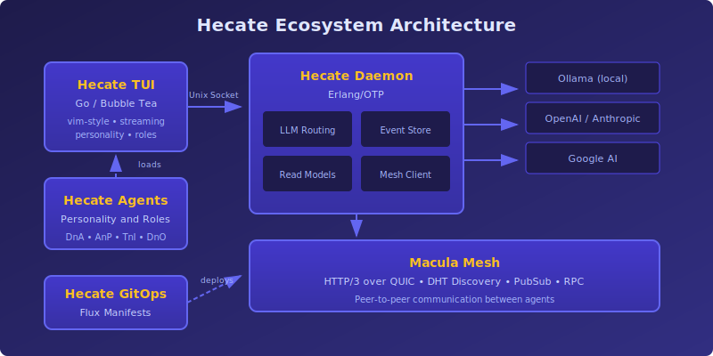

# Hecate

<div align="center">
  

  <h3>Your Applications. Your Data. Your Infrastructure.</h3>

  <p><em>A local-first development platform for building distributed applications on the Macula mesh network.</em></p>

  [](LICENSE)
  [](https://buymeacoffee.com/rlefever)
</div>

---

## Why Hecate Exists

### The Problem with Cloud-First

Modern software development has become synonymous with cloud dependency. Your code lives on GitHub. Your CI runs on someone else's servers. Your data sits in someone else's database. Your AI assistant phones home with every keystroke.

This works — until it doesn't. An API key expires and your pipeline stops. A provider changes pricing and your costs triple. A region goes down and you're offline. A terms-of-service change and your data is someone else's training set.

**You don't own your infrastructure. You rent it.**

### The Briefcase Model

Hecate takes a different approach. Think of a briefcase:

- **Everything you need is inside.** Your identity, your keys, your data, your event history — all on your machine.
- **You carry it with you.** Move to a new device, plug in, and your agent is running in minutes.
- **You open it when you choose.** Connect to the mesh to share capabilities, discover peers, and collaborate — on your terms.
- **Nobody can take it from you.** No vendor lock-in. No cloud dependency. No single point of failure.

This is **local-first, mesh-connected** software. Your Hecate daemon runs on your hardware. It stores events in a local ReckonDB instance. It serves your frontends over a Unix socket. When you connect to the Macula mesh, you're a peer — not a tenant.

### Decentralization as Architecture

Hecate is not decentralized for ideology. It's decentralized because it's the right architecture for agent-based systems:

- **Agents are autonomous.** An agent that stops working when a central server is unreachable isn't autonomous — it's a client.
- **Data has gravity.** Processing data where it lives (at the edge) is faster, cheaper, and more private than shipping it to the cloud.
- **Mesh > Hub.** A network where every node can discover, communicate, and collaborate directly is more resilient than one that routes everything through a center.
- **Event sourcing enables sovereignty.** When your history is an append-only log of events, you can replay, audit, fork, and migrate without depending on anyone else's schema.

<p align="center">
  
</p>

---

## The Platform

| Component | Description | |
|-----------|-------------|---|
| [**hecate-daemon**](https://github.com/hecate-social/hecate-daemon) | Erlang/OTP runtime — identity, event sourcing, LLM routing, mesh connectivity | [ghcr.io](https://ghcr.io/hecate-social/hecate-daemon) |
| [**hecate-web**](https://github.com/hecate-social/hecate-web) | Native desktop app — studios for LLM, node management, DevOps (Tauri/SvelteKit) | [Releases](https://github.com/hecate-social/hecate-web/releases) |
| [**hecate-agents**](https://github.com/hecate-social/hecate-agents) | Philosophy, skills, and guardrails — the agent's personality and knowledge base | |
| [**hecate-install**](https://github.com/hecate-social/hecate-install) | One-command installer + NixOS flake for bootable media | |
| [**hecate-gitops**](https://github.com/hecate-social/hecate-gitops) | Per-node Quadlet templates + reconciler for systemd+podman deployment | |

**Plugin apps** extend the platform:

| Plugin | Daemon | Frontend | Description |
|--------|--------|----------|-------------|
| [**Martha**](https://github.com/hecate-social/hecate-martha) | hecate-marthad | hecate-marthaw | AI coding agent with venture lifecycle |
| [**Trader**](https://github.com/hecate-social/hecate-trader) | hecate-traderd | hecate-traderw | Trading agent |

---

## Guides

### Philosophy

| # | Guide | What You'll Learn |
|---|-------|-------------------|
| 1 | [**Overview**](guides/overview.md) | What Hecate is, why it exists, core principles |
| 2 | [**Mental Model**](guides/mental-model.md) | The company metaphor — Venture, Division, Department, Desk, Dossier |
| 3 | [**Application Lifecycle**](guides/application-lifecycle.md) | The ten processes, ALC phases (DnA/AnP/TnI/DnO), lifecycle protocol |

### Architecture

| # | Guide | What You'll Learn |
|---|-------|-------------------|
| 4 | [**Architecture**](guides/architecture.md) | System components, CQRS, event flow, deployment topology |
| 5 | [**Macula Mesh**](guides/macula-mesh.md) | How the mesh works, Hecate's role, pub/sub, RPC, identity |
| 6 | [**App Development**](guides/app-development.md) | Building Hecate plugins with ReckonDB — using Martha as reference |

### Usage

| # | Guide | What You'll Learn |
|---|-------|-------------------|
| 7 | [**Getting Started**](guides/getting-started.md) | Install Hecate and run your first session |
| 8 | [**Hecate Web**](guides/hecate-web.md) | Desktop app — studios, event storming, node dashboard |
| 9 | [**Personality System**](guides/personality-system.md) | Configure AI behavior per ALC phase |
| 10 | [**Daemon API**](guides/daemon-api.md) | REST API reference (Unix socket) |
| 11 | [**Deployment**](guides/deployment.md) | systemd + podman deployment via GitOps reconciler |

### Diagrams

All architectural diagrams are in [`assets/`](assets/):

| Diagram | Shows |
|---------|-------|
| [Ecosystem Overview](assets/ecosystem-overview.svg) | Platform components and their relationships |
| [ALC Lifecycle](assets/alc-lifecycle.svg) | The four development phases as a wheel |
| [Division Architecture](assets/cartwheel-architecture.svg) | CMD/PRJ/QRY departments with vertical slices |
| [Company Model](assets/cartwheel-company-model.svg) | Venture → Division → Department → Desk hierarchy |
| [Complete Flow](assets/cartwheel-complete-flow.svg) | Full system flow through all departments |
| [Write Sequence](assets/cartwheel-write-sequence.svg) | Command → Event → ReckonDB |
| [Projection Sequence](assets/cartwheel-projection-sequence.svg) | Event → Projection → SQLite |
| [Query Sequence](assets/cartwheel-query-sequence.svg) | Query endpoint → SQLite read model |
| [Data Flow](assets/data-flow.svg) | Internal data flow within a division |
| [Mental Model](assets/mental-model.svg) | The company metaphor visualized |

---

## Quick Start

```bash
# One-command install (Linux)
curl -fsSL https://raw.githubusercontent.com/hecate-social/hecate-install/main/install.sh | bash
```

This installs podman, the daemon, the reconciler, and optionally the desktop app and Ollama. See [Getting Started](guides/getting-started.md) for details.

---

## Foundation Ecosystems

Hecate composes three independent ecosystems:

| Ecosystem | Purpose | Organization |
|-----------|---------|-------------|
| [**Macula**](https://github.com/macula-io/macula-ecosystem) | HTTP/3 mesh networking — DHT discovery, PubSub, RPC, NAT traversal | [macula-io](https://github.com/macula-io) |
| [**Reckon**](https://github.com/reckon-db-org/reckon-ecosystem) | Event sourcing — distributed event store, CQRS framework, projections | [reckon-db-org](https://github.com/reckon-db-org) |
| [**Faber**](https://github.com/rgfaber/faber-ecosystem) | AI & neuroevolution — TWEANN neural networks, NEAT, LTC neurons | [rgfaber](https://github.com/rgfaber) |

---

## Community

- **GitHub**: [hecate-social](https://github.com/hecate-social)
- **Support**: [Buy Me a Coffee](https://buymeacoffee.com/rlefever)

## License

Apache 2.0 — See [LICENSE](LICENSE)

---

<p align="center">
  <sub>Named after the Greek goddess of crossroads and guidance.<br/>Built with Erlang/OTP, Rust, and SvelteKit on the BEAM.</sub>
</p>
