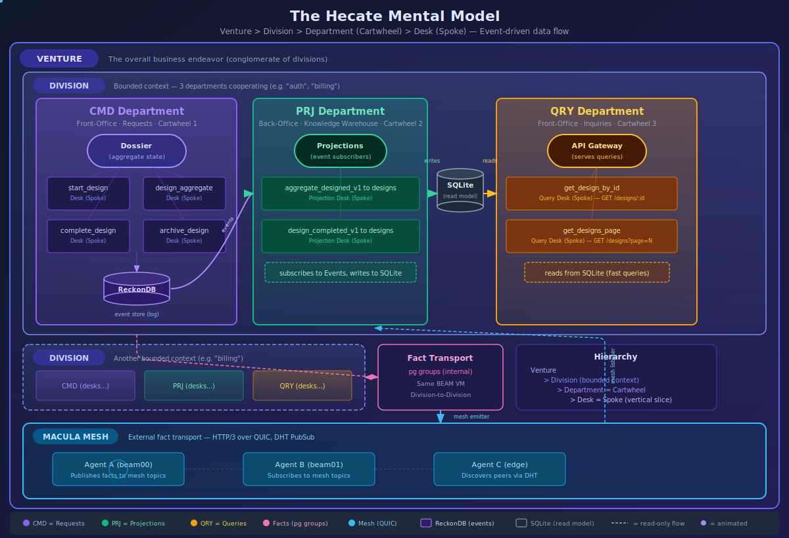

# The Mental Model

Hecate uses a **company metaphor** to make distributed, event-sourced architecture intuitive. Every concept maps from an office you can picture to a technical structure you can build.

<p align="center">
  
</p>

---

## The Hierarchy

```
Venture
  └── Division
       ├── CMD Department (Cartwheel)
       │    └── Desks (Spokes)
       ├── PRJ Department (Cartwheel)
       │    └── Desks (Spokes)
       └── QRY Department (Cartwheel)
            └── Desks (Spokes)
```

Four levels. Each maps from a business concept to a technical structure.

---

## Venture — The Conglomerate

A **Venture** is the overall business endeavor. It is a conglomerate of divisions that co-operate to deliver value.

| Aspect | Description |
|--------|------------|
| **Business** | A company or project — "my-saas-app", "trading-platform" |
| **Technical** | The top-level entity. Contains N divisions. |
| **In the daemon** | Created by `setup_venture`, tracked by `guide_venture` |

A venture has a name, a brief, and a vision. That's it. Everything else lives in divisions.

---

## Division — The Bounded Context

A **Division** is a cohesive piece of software — a bounded context in DDD terms. Each division has exactly three departments.

| Aspect | Description |
|--------|------------|
| **Business** | A department group — "auth", "billing", "notifications" |
| **Technical** | Three OTP applications cooperating (CMD, PRJ, QRY) |
| **In the daemon** | Discovered by `discover_divisions`, then each division goes through design → plan → generate → test → deploy → monitor → rescue |

The key insight: **a division is not one app — it's three departments cooperating.**

---

## Department — The Cartwheel

A **Department** is a single Cartwheel. This is where the company metaphor meets the technical architecture.

### The Cartwheel Shape

Picture a wheel:
- The **hub** at the center holds state (the aggregate/dossier for CMD, the SQLite store for PRJ/QRY)
- **Spokes** radiate outward — each spoke is a desk where specific work happens

```
            spoke
             │
    spoke ── HUB ── spoke
             │
            spoke
```

### Three Departments, Three Cartwheels

Each division contains exactly three departments. Each one is its own cartwheel:

| Department | Role | Office Type | Hub | Spokes |
|------------|------|-------------|-----|--------|
| **CMD** | Receives requests, produces events | Front-office | Dossier (aggregate) | Command desks |
| **PRJ** | Subscribes to events, builds read models | Back-office | SQLite store | Projection desks |
| **QRY** | Serves inquiries from read models | Front-office | API gateway | Query desks |

### The Front-Office / Back-Office Split

Two departments face the outside world (**front-office**):

- **CMD** — the **Request desk**. Customers walk in with requests. The clerk validates, processes, and produces events.
- **QRY** — the **Inquiry desk**. Customers walk in with questions. The clerk looks up the answer in the filing cabinet.

One department works internally (**back-office**):

- **PRJ** — the **Knowledge Warehouse**. Workers receive events through tube mail, file them into cabinets (SQLite), and keep the filing system up to date so the Inquiry desk can serve fast answers.

---

## Desk — The Spoke

A **Desk** is a single capability — a vertical slice of functionality. It is the spoke in the cartwheel.

### What Makes a Desk

Each desk is **self-contained**. It owns everything it needs:

| Component | File | Purpose |
|-----------|------|---------|
| Command | `register_user_v1.erl` | The request structure |
| Event | `user_registered_v1.erl` | What happened (the slip) |
| Handler | `maybe_register_user.erl` | Business logic and validation |
| Emitter | `user_registered_v1_to_pg.erl` | Publishes facts internally |
| Emitter | `user_registered_v1_to_mesh.erl` | Publishes facts externally |
| API | `register_user_api.erl` | HTTP endpoint |

### The Desk Types

Different departments have different types of desks:

| Department | Desk Type | Example | What It Does |
|------------|-----------|---------|-------------|
| **CMD** | Command desk | `register_user/` | Validates request, produces event |
| **CMD** | Lifecycle desk | `start_design/` | Manages process state transitions |
| **PRJ** | Projection desk | `user_registered_v1_to_users/` | Subscribes to event, updates read model |
| **QRY** | Query desk | `get_user_by_id/` | Reads from SQLite, returns result |

### Vertical Slicing

> **Add a feature → Add a desk (folder).**
> **Delete a feature → Delete a desk (folder).**

No shared `services/`, `utils/`, or `handlers/` directories. Each desk is its own world.

---

## The Dossier — The Aggregate

The **Dossier** is the folder of event slips that passes through desks. It is the aggregate in event-sourcing terms, but thought of as a process artifact rather than a data object.

```
Traditional:                         Hecate:
─────────────                        ───────
Aggregate = object with state        Dossier = ordered event slips
Events = mutations to the object     Slips = facts added at desks
Question: "What IS this thing?"      Question: "What has HAPPENED?"
```

Imagine a physical folder moving through an office:

1. **Dossier arrives** at a desk
2. **Clerk reviews** the slips inside (events so far)
3. **Clerk may add** a new slip (new event) if business rules allow
4. **Dossier moves on** to the next desk

---

## Data Flow — Events and Facts

The mental model has two kinds of data flow:

### Events (within a division)

Events flow from CMD through ReckonDB to PRJ to QRY:

```
CMD Cartwheel              PRJ Cartwheel              QRY Cartwheel
(Front-Office)             (Back-Office)              (Front-Office)

[desk] → command           [desk] ← event             [desk] ← query
         ↓                          ↓                          ↑
     aggregate              SQLite INSERT/UPDATE        SQLite SELECT
         ↓                          ↓                          ↑
       event ──→ ReckonDB ──→ subscription             read model
```

This is the **write → project → query** cycle within one division.

### Facts (between divisions and agents)

Divisions don't call each other. They communicate through **facts** — events published to shared channels:

| Channel | Scope | Technology | Use |
|---------|-------|-----------|-----|
| **pg groups** | Internal (same BEAM VM) | OTP process groups | Division-to-division within one daemon |
| **Macula Mesh** | External (WAN) | HTTP/3 over QUIC, DHT PubSub | Agent-to-agent across machines |

When `design_division` completes, it publishes a `design_completed_v1` fact. `plan_division` subscribes and reacts — now planning can begin.

When an agent on `beam00` discovers a division, it publishes a fact to the mesh. An agent on `beam01` subscribes and learns about it.

---

## Mapping Table

| Company Model | Cartwheel Architecture | Technical Realization | Example |
|---------------|----------------------|----------------------|---------|
| **Venture** | Conglomerate | Top-level entity | `my-saas-app` |
| **Division** | 3 Departments | 3 OTP apps (CMD + PRJ + QRY) | `auth` division |
| **Department** | **Cartwheel** | 1 OTP app with hub + spokes | `design_division` (CMD) |
| **Desk** | **Spoke** | 1 directory with command + event + handler | `register_user/` |
| **Dossier** | Aggregate | In-memory state rebuilt from events | `design_aggregate.erl` |
| **Slip** | Event | Immutable fact stored in ReckonDB | `aggregate_designed_v1` |
| **Filing Cabinet** | Read Model | SQLite table | `designs` table |
| **Tube Mail** | Subscription | ReckonDB → PRJ projection | `on_aggregate_designed_v1.erl` |
| **Fact** | Integration Event | pg group or mesh topic message | `design_completed_v1` |

---

## App Naming Convention

Names scream intent. No guessing required.

| Department | Naming Rule | Example |
|------------|------------|---------|
| **CMD** | Process verb (what it does) | `design_division`, `deploy_division` |
| **QRY+PRJ** | `query_{read_model}` (what it serves) | `query_designs`, `query_deployments` |

No `manage_` prefix. CMD supports a process, not data management.

---

## Next Steps

- [Application Lifecycle](application-lifecycle.md) — The ten processes and lifecycle protocol
- [Architecture](architecture.md) — Component details and deployment patterns
- [Daemon API](daemon-api.md) — REST API reference
